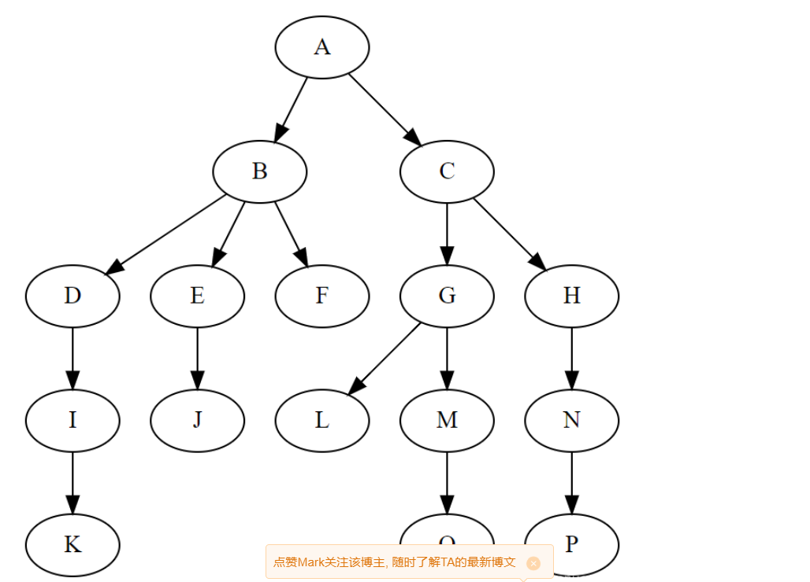

# 算法和数据结构
## 数据结构
### 线性表

​       线性表主要由顺序表示或链式表示。在实际应用中，常以栈、队列、字符串等特殊形式使用。
顺序表示指的是用一组地址连续的存储单元依次存储线性表的数据元素，称为线性表的顺序存储结构或顺序映像（sequential mapping）。它以“物理位置相邻”来表示线性表中数据元素间的逻辑关系，可随机存取表中任一元素。
​       链式表示指的是用一组任意的存储单元存储线性表中的数据元素，称为线性表的链式存储结构。它的存储单元可以是连续的，也可以是不连续的。在表示数据元素之间的逻辑关系时，除了存储其本身的信息之外，还需存储一个指示其直接后继的信息（即直接后继的存储位置），这两部分信息组成数据元素的存储映像，称为结点（node）。它包括两个域；存储数据元素信息的域称为数据域；存储直接后继存储位置的域称为指针域。指针域中存储的信息称为指针或链。

**特点**

   1.均匀性：虽然不同数据表的数据元素可以是各种各样的，但对于同一线性表的各数据元素必定具有相同的数据类型和长度。

   2.有序性：各数据元素在线性表中的位置只取决于它们的序号，数据元素之前的相对位置是线性的，即存在唯一的“第一个“和“最后一个”的数据元素，除了第一个和最后一个外，其它元素前面均只有一个数据元素(直接前驱)和后面均只有一个数据元素（直接后继）。

### 树

在计算器科学中，树（英语：tree）是一种抽象数据类型或是实现这种抽象数据类型的数据结构，用来模拟具有树状结构性质的数据集合。它是由n（n>0）个有限节点组成一个具有层次关系的集合。把它叫做“树”是因为它看起来像一棵倒挂的树，也就是说它是根朝上，而叶朝下的。它具有以下的特点：

​    ①每个节点有零个或多个子节点；
​    ②没有父节点的节点称为根节点；
​    ③每一个非根节点有且只有一个父节点；
​    ④除了根节点外，每个子节点可以分为多个不相交的子树；
   

然后你要知道一大堆关于树的术语：度，叶子节点，根节点，父节点，子节点，深度，高度。

#### 二叉树

二叉树：每个节点最多含有两个子树的树称为二叉树。（我们一般在书中试题中见到的树是二叉树，但并不意味着所有的树都是二叉树。）

在二叉树的概念下又衍生出满二叉树和完全二叉树的概念

**满二叉树：**除最后一层无任何子节点外，每一层上的所有结点都有两个子结点。也可以这样理解，除叶子结点外的所有结点均有两个子结点。节点数达到最大值，所有叶子结点必须在同一层上
**完全二叉树：**若设二叉树的深度为h，除第 h 层外，其它各层 (1～(h-1)层) 的结点数都达到最大个数，第h层所有的结点都连续集中在最左边，这就是完全二叉树。

**二叉查找树：**

**平衡二叉树（AVL）：**

**红黑树：**

### 图